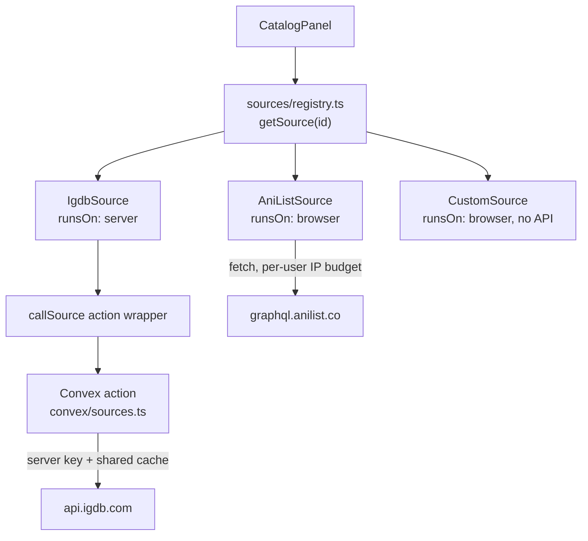

# Catalog sources

**Status: Planned.** Nothing here exists. Today `src/lib/anilist.ts` is imported
directly by `CatalogPanel` and `AnimeDetailModal`.

This is the change that turns an anime tier list into a tier list platform. It
is worth doing carefully because it touches the persisted shape
([data-model.md](data-model.md#part-2--savefile-v2-generalized-planned)) and
because one existing decision — browser-direct API calls — does not generalize.

## The problem with generalizing

`src/lib/anilist.ts` calls `graphql.anilist.co` straight from the browser. That
is correct for AniList and correct only for AniList:

- AniList rate-limits **per IP**, needs **no key**, and sends **open CORS**. Each
  user gets their own budget, so the app scales with zero server capacity. This
  is [decisions.md D3](../decisions.md#d3) and it should not be reversed.
- IGDB (games), TMDB (film/TV), Spotify (music), and most others require a
  **secret** and often reject browser origins. Those cannot run client-side at
  any price.

So the abstraction cannot assume one execution location. A source has to declare
where it runs, and the catalog has to call it the same way either way.

## The interface

```ts
// src/lib/sources/types.ts (Planned)

export type SourceId = "anilist" | "igdb" | "tmdb" | "custom" | (string & {});

export type SourceCapability = "search" | "browse" | "import" | "detail";

export interface SourceDescriptor {
  id: SourceId;
  /** Key prefix in ItemKey. Must be stable forever — it is inside saved data. */
  prefix: string;              // "al", "igdb", "tmdb", "cst"
  label: string;               // "AniList"
  topics: TopicId[];           // ["anime"]
  capabilities: SourceCapability[];
  /** "browser" keeps per-user rate limits; "server" is required for keyed APIs. */
  runsOn: "browser" | "server";
  /** Hosts whose images this source hotlinks. Used by CSP + the OG renderer. */
  imageHosts: string[];
}

export interface CatalogSource {
  descriptor: SourceDescriptor;
  browse?(signal?: AbortSignal): Promise<Item[]>;
  search?(query: string, signal?: AbortSignal): Promise<Item[]>;
  /** Import someone's existing list, by handle or URL. */
  import?(handle: string, signal?: AbortSignal): Promise<Item[]>;
  detail?(sourceId: string, signal?: AbortSignal): Promise<ItemDetail>;
}
```

`ItemDetail` replaces today's `MediaDetail` and stays un-persisted. It should be
mostly-optional fields plus a `sections: { label, value }[]` escape hatch, so a
source can surface "Studio" or "Developer" or "Label" without the type growing a
union of every vertical.

## Two implementations of the same interface



`CatalogPanel` never learns which kind it got. A `runsOn: "server"` source is a
thin client whose methods call one Convex action:

```ts
// sources/serverSource.ts (Planned) — sketch
const remote = (d: SourceDescriptor): CatalogSource => ({
  descriptor: d,
  search: (q, signal) =>
    convexAction(api.sources.search, { source: d.id, query: q }, signal),
  // ...
});
```

Two consequences fall out of this, and both are features:

- A server source **can** cache across users, because it is behind one process.
  That is the shared cache D3 says to build before proxying — it just applies to
  the sources that were never browser-eligible.
- A server source **requires a Convex deployment**. Today the app runs with
  `NEXT_PUBLIC_CONVEX_URL` unset. Keep that true: the registry must filter to
  browser-only sources when `convex` is `null`, so a keyless clone still gets
  AniList and custom items.

## The `custom` source

The one that makes the platform general. No API, no network, no key.

- `search` returns `[]`.
- The catalog shows a "create an item" form instead of a result grid: title,
  optional subtitle, optional image **URL** (not upload — see
  [decisions.md D6](../decisions.md#d6)).
- Keys are `cst:${nanoid(8)}`, generated client-side.
- The `Item` is fully self-contained, so a board of custom items publishes and
  renders with no source available at all.

Custom items are how "rank my friends", "rank fast-food fries", and every joke
tier list get built. Ship this **before** the second API source: it is less work
and it is the larger share of what people make.

## Item keys and prefixes

`ItemKey` is `${prefix}:${sourceId}`. The prefix is written into saved data, so:

1. A prefix is permanent. Renaming one means migrating every saved and published
   board.
2. Prefixes must be unique across the registry. Add a startup assertion in
   `registry.ts` — a duplicate prefix silently corrupts boards, which is the
   worst possible failure mode.
3. Prefixes stay short. They repeat once per item in every stored document.

| Source | Prefix | Status |
| --- | --- | --- |
| AniList | `al` | In use today (`toMedia` in `src/lib/anilist.ts`) |
| MyAnimeList | `mal` | Reserved in `MediaSource` today; never emitted |
| Custom | `cst` | Planned |
| IGDB | `igdb` | Planned |
| TMDB | `tmdb` | Planned |

## Topics

A `TopicId` groups sources and labels a board. `topic` on the `SaveFile` picks
which sources the catalog offers, and later drives feed facets and browse pages.

Start with: `anime`, `games`, `film`, `music`, `custom`. Adding a topic must be
a registry entry, never a code branch in `CatalogPanel`.

A board is single-topic in the UI but the data does not forbid mixing sources —
prefixed keys already make a mixed board valid. Leave it permitted and
undocumented rather than enforcing single-topic in the schema; someone will want
"anime vs games" and the model already supports it.

## Migration path

Do this in order. Each step ships on its own.

1. **Rename in place.** `Media` → `Item`, `media` → `items`, `cover` → `image`,
   `format` → `meta.kind`, `idMal` → `externalIds.mal`. Bump to `schema: 2` with
   `v1ToV2`. No behaviour change, no new source. This is the risky step, so it
   goes first and alone.
2. **Extract the interface.** Move `src/lib/anilist.ts` to
   `src/lib/sources/anilist.ts` implementing `CatalogSource`. Add
   `registry.ts`. `CatalogPanel` takes a `SourceId` prop and resolves through
   the registry. Still one source; behaviour identical.
3. **Add `custom`.** Second implementation proves the interface. First time a
   non-anime board is possible.
4. **Add one server source.** Third implementation proves `runsOn: "server"` and
   the Convex action wrapper.

Step 2 is where the interface gets validated against reality — if
`fetchUserList`'s AniList-specific score normalisation (`normalizeScore`, five
`ScoreFormat` variants) doesn't fit under `import(handle)`, that is the signal to
adjust the interface, not to special-case AniList in `CatalogPanel`.

## What not to do

- **Don't proxy AniList.** Every user behind the server's one IP caps the entire
  app at AniList's 30 req/min, globally. See [D3](../decisions.md#d3).
- **Don't put source-specific fields back on `Item`.** They go in `meta`. The
  moment `Item` grows a `developer` field, the abstraction is gone.
- **Don't branch app logic on `meta`.** It is display-only. If board behaviour
  needs to know something, it belongs on `Item` proper or on the descriptor.
- **Don't accept image uploads.** URL-from-allowlisted-host at most. The
  moderation obligation is the blocker, not the storage bill — [D6](../decisions.md#d6).
