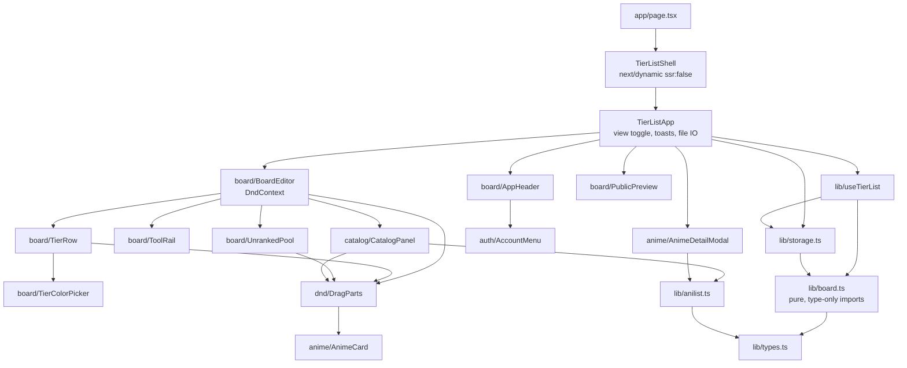

# Components and layering

C4 level 3. Every name below exists in the repo today unless marked Planned.

## The layer spine

There is no controller/service/repository stack here — it's a client app. The
equivalent spine is four layers, and the rule that keeps it maintainable is that
**dependencies only ever point downward**.

| Layer | Contents | May import |
| --- | --- | --- |
| **Route** | `src/app/` — `page.tsx`, `t/[slug]/`, `tierlists/`, `tierlist/`, `layout.tsx` | Shell only |
| **Container** | `TierListShell`, `TierListApp`, `BoardEditor`, `CatalogPanel`, `MyBoards` | Anything below |
| **Presentational** | `src/components/ui/`, `anime/`, `board/`, `auth/`, `feed/` | `lib/` types + helpers only |
| **Domain / IO** | `src/lib/` — `board.ts`, `publish.ts`, `feed.ts`, `storage.ts`, `anilist.ts`, `types.ts` | Each other, nothing from `components/` |
| **Backend** | `convex/` — `tierlists.ts`, `users.ts`, `lib/auth.ts`, `schema.ts` | `src/lib/` pure modules, nothing from `components/` |

The server-rendered routes are the exception to "Route = shell only": `/` and
`/t/[slug]` fetch their own data and compose sections directly. There is no
container between them because there is no state to hold — the search term
lives in the URL, and everything else is read once and rendered.

**`convex/` may import from `src/lib/`, never the reverse.** `tierlists.ts`
imports `prepareBoard` so the caps and the sanitiser exist once rather than
twice; client code reaches the other way only through `import type`, which is
erased. That keeps `convex/_generated/server` out of the browser bundle.

`src/lib/board.ts` is the strictest case: it imports **types only**, all of them
erased at compile time. That is what lets `node --test` run `board.test.ts`
directly against it with no bundler and no test framework — see the file's own
header comment. Adding a runtime import to `board.ts` breaks `npm test`.

`lib/publish.ts` follows the same rule and is tested the same way. Its one
runtime import is `parseSaveFile` from `storage.ts`, which in turn imports
`board.ts` — and that chain is why both carry a `./name.ts` specifier, extension
included: Node's ESM loader will not resolve an extensionless relative path.
`allowImportingTsExtensions` in both `tsconfig.json` and `convex/tsconfig.json`
is what lets the same specifier compile. Every other `lib/` import stays
extensionless; only the chain a test walks needs this.

## Tests

Two runners, because the two halves have different needs:

| Command | Runner | Covers |
| --- | --- | --- |
| `npm run test:lib` | `node --test`, no framework | `src/lib/*.test.ts` — pure logic |
| `npm run test:convex` | `vitest` + `convex-test` + `@edge-runtime/vm` | `convex/*.test.ts` — functions, against an in-memory database |
| `npm test` | both | |

The `node --test` half is deliberately runner-free and is why `lib/` modules
stay import-pure. The Convex half cannot be: `convex-test` needs a real module
graph (`import.meta.glob`) and an edge runtime. It is worth the two dev
dependencies because it is the only way to exercise the authorization negatives
— a stranger updating or deleting someone's board, a private board staying out
of `bySlug` and the feed.

## Module map



Two edges are worth defending:

- **`storage.ts` → `board.ts`** exists only to reuse `TIER_PRESET_COLORS` as a
  fallback colour when parsing a tier with a missing/invalid `color`. It is the
  single runtime coupling between the two.
- **`dnd/DragParts` sits between the board components and `AnimeCard`.** Drag
  wiring is deliberately kept out of presentational components so `AnimeCard`
  stays renderable in the drag overlay, in the preview, and in the catalog with
  no dnd context — `BoardEditor` renders it bare inside `DragOverlay`.

## `src/lib` — the domain layer

| Module | Responsibility | Notes |
| --- | --- | --- |
| `types.ts` | The persisted shape: `SaveFile`, `Tier`, `Media`, `MediaKey`, `Region`, plus `MediaDetail` which is never persisted | Also exports the `Region` helpers `isTierRegion` and `tierIdOf` |
| `board.ts` | Pure board operations. Every function takes a `SaveFile` and returns a new one | `createEmptySave`, `placedKeys`, `itemsOf`, `moveItem`, `addMedia`, `addManyToPool`, `removeItem`, `addTier`, `removeTier`, `reorderTiers`, `renameTier`, `recolorTier`, `setTitle`, `rankedCount` |
| `storage.ts` | Trust boundary + persistence. `parseSaveFile`, `loadSave`, `persistSave`, `downloadSaveFile`, `readSaveFile`, `slugify` | Only module that touches `window.localStorage` |
| `anilist.ts` | GraphQL client. `searchAnime`, `fetchTrending`, `fetchUserList`, `fetchAnimeDetail`, `AniListError` | Only module that knows AniList exists. **This is the seam for multi-topic** — see [catalog-sources.md](catalog-sources.md) |
| `useTierList.ts` | Board state, undo/redo, autosave. Exports `useTierList` and the `TierListStore` type | The single source of board truth |
| `useToast.ts` | Transient message state | |
| `useDebounced.ts` | Value debouncer | Used at 350ms by `CatalogPanel` |
| `img.ts` | `retryCover` — one-shot cache-busting retry for AniList CDN CORS misses | See its header comment; the cause is real and non-obvious |
| `cn.ts` | Class-name join | 3 lines |

### Purity as a testing strategy

`board.ts` returns a new object from every mutating operation, which buys three
things at once: undo is a plain array of previous `SaveFile` snapshots
(`useTierList` keeps up to `HISTORY_LIMIT = 50`), React re-renders correctly
because identity changes, and the whole module is testable with no setup. When
you add a board operation, add it to `board.ts` and `board.test.ts` — not to the
hook.

## `src/components/ui` — the design system

`Text`, `Button`, `IconButton`, `TextInput`, `Segmented`, `Modal`, `Tag`,
`Toast`, `ExternalLink`.

The house rule from the root README: **every piece of text renders through
`ui/Text.tsx`**. Change a size or tone there, not in a component. Details in
[frontend/design-system.md](../frontend/design-system.md).

## Convex functions

Today the deployment is auth plus one query.

| File | Contents |
| --- | --- |
| `convex/schema.ts` | `defineSchema({ ...authTables })` — nothing custom |
| `convex/auth.ts` | `convexAuth({ providers: [Google, GitHub] })`, exporting `auth`, `signIn`, `signOut`, `store`, `isAuthenticated` |
| `convex/auth.config.ts` | Trusts JWTs from `CONVEX_SITE_URL` with `applicationID: "convex"` |
| `convex/http.ts` | `httpRouter()` with `auth.addHttpRoutes(http)` and nothing else |
| `convex/users.ts` | `viewer` query — returns `{ id, name, email, image, provider }` or `null` |

`viewer` returns `null` rather than throwing, because signed-out is a normal
answer to the question the UI is asking. The file's own comment states the
counter-rule: **anything that writes must throw on a null user id.** When the
first mutation lands, that rule needs enforcing in one shared helper, not
repeated per function — see [social-feed.md](social-feed.md#authorization).

## Planned module layout

Nothing below exists yet. Listed so new work lands in a predictable place.

```
src/
  app/
    page.tsx                editor (built)
    t/[slug]/page.tsx       public board, server component
    u/[handle]/page.tsx     profile
    feed/page.tsx           newsfeed
  lib/
    sources/
      types.ts              CatalogSource interface
      registry.ts           id -> source lookup
      anilist.ts            moved from lib/anilist.ts
      custom.ts             user-defined items, no external API
convex/
  schema.ts                 + tierlists, profiles, follows, likes, comments, feedEvents
  tierlists.ts              publish, update, get, listByOwner
  social.ts                 follow, like, comment
  feed.ts                   home feed query
  lib/auth.ts               requireUser helper
```

## Dependency rules to keep

1. `src/lib/board.ts` imports types only. Nothing else, ever.
2. Nothing in `src/lib/` imports from `src/components/`.
3. Presentational components in `ui/` take props and render; they don't call
   `lib/anilist.ts` or read storage.
4. Only `storage.ts` touches `localStorage`; only `anilist.ts` (later
   `lib/sources/*`) touches an external API from the browser.
5. Only `ConvexClientProvider` reads `NEXT_PUBLIC_CONVEX_URL`. Everything else
   imports the exported `convex` and null-checks it.
