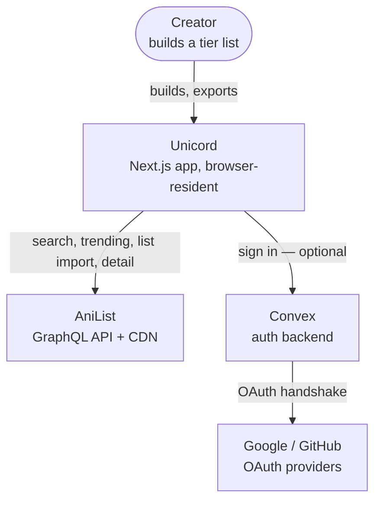
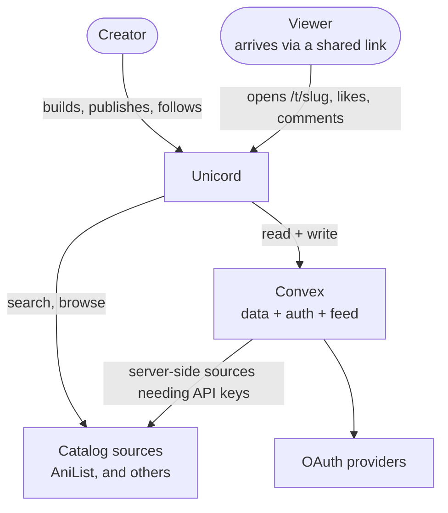
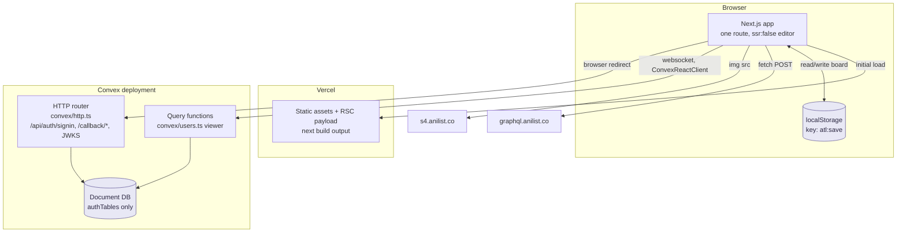
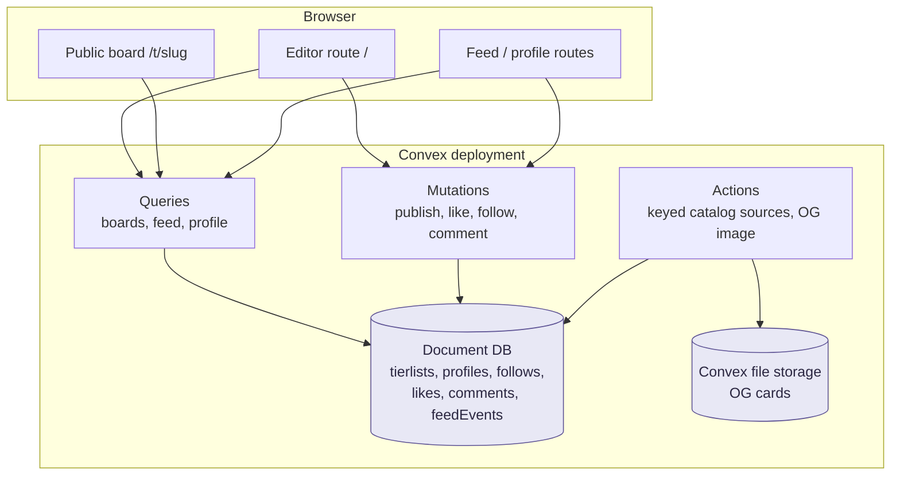

# System context and containers

C4 levels 1 and 2. Level 3 (components) is [components.md](components.md).

## Level 1 — Context (Built)

Today there is one user type and no server-held state.

## Level 1 — Context (Planned)

The social platform adds a second actor who never touches the editor, and makes
the backend load-bearing.

The new edge worth noticing is **Convex → catalog sources**. Some sources
(games, film, music) require an API key that cannot ship to a browser, so they
must run in a Convex action. AniList must keep running in the browser for the
rate-limit reason in [decisions.md D3](../decisions.md#d3). The source interface
therefore has to support both — that constraint drives
[catalog-sources.md](catalog-sources.md).

## Level 2 — Containers (Built)

### Container notes

**Next.js app.** Deployed on Vercel (inferred from `@vercel/analytics` in
`src/app/layout.tsx` and the `vercel/install-vercel-web-analytics` merge in git
history). No `vercel.json` is checked in, so the deployment uses framework
defaults. Marked **inferred** — confirm before relying on it.

**localStorage.** One key, `atl:save`, holding a `SaveFile`. Defined as
`SAVE_KEY` in `src/lib/storage.ts`.

> **Discrepancy.** [data-model.md](data-model.md) previously documented a second
> key, `atl:tokens`, for share-link edit tokens. No such key exists in code —
> it belongs to unbuilt Phase 2 work and is now marked Planned.

**Convex deployment.** `convex/http.ts` mounts only what `auth.addHttpRoutes`
provides. `convex/schema.ts` spreads `authTables` and adds nothing. The only
application function in the deployment is the `viewer` query.

**Optionality.** `src/components/ConvexClientProvider.tsx` reads
`process.env.NEXT_PUBLIC_CONVEX_URL` and exports `convex` as `null` when it is
unset, rendering children without a provider. Every consumer of Convex hooks
must null-check `convex` first, because the hooks throw with no provider above
them. This is what makes a clone-and-run with no Convex account work.

## Level 2 — Containers (Planned)

`/t/[slug]` is the one route that should be server-rendered, for OpenGraph tags
and for viewers who arrive without JavaScript warm. That requirement is exactly
the trigger condition recorded in [decisions.md D11](../decisions.md#d11) for
switching from `@convex-dev/auth/react` to `/nextjs` — plan for it before
building sharing, not after.

## Trust boundaries

| Boundary | Crossed by | Enforcement today |
| --- | --- | --- |
| Untrusted JSON → app | Uploaded `.json`, `localStorage` contents | `parseSaveFile` in `src/lib/storage.ts` — throws with a readable reason, drops keys with no `media` record |
| App → AniList | `fetch` from `src/lib/anilist.ts` | No key, no credentials; errors surfaced through `AniListError` |
| Browser → Convex | Websocket + OAuth redirect | Convex Auth JWT; `convex/auth.config.ts` trusts `CONVEX_SITE_URL` |
| **Planned:** client → published board | Publish/update mutations | Not built. Payload caps, rate limits, and text sanitisation are specified in [sharing.md](sharing.md) and are non-negotiable for that phase. |
