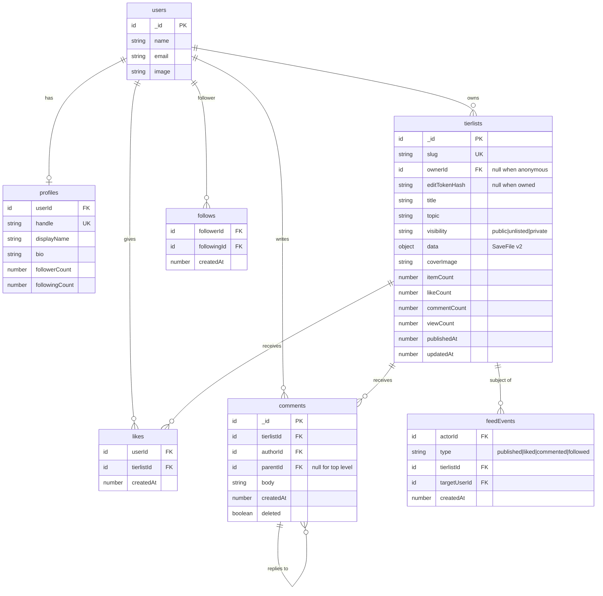

# Data model

Two halves: the `SaveFile` that exists today, and the Convex schema it grows
into. The migration between them is the single most consequential piece of
planning in this repo, because every board anyone has ever saved is in the old
shape.

---

# Part 1 — `SaveFile` (Built)

Defined in [`src/lib/types.ts`](../../src/lib/types.ts). One shape, currently
two homes: `localStorage["atl:save"]` and the exported `.json`.

```ts
type SaveFile = {
  schema: 1;
  title: string;
  updatedAt: string;              // ISO 8601
  tiers: Tier[];
  pool: MediaKey[];
  media: Record<MediaKey, Media>;
};

type Tier = {
  id: string;                     // nanoid(6), or "t1".."t6" for the defaults
  label: string;
  color: string;                  // hex
  items: MediaKey[];              // ordered
};

/** `${sourcePrefix}:${id}` — today always "al:<anilistId>" */
type MediaKey = string;

type Media = {
  key: MediaKey;
  source: "anilist" | "mal";
  id: number;
  idMal: number | null;
  title: string;                  // romaji
  titleEn: string | null;
  cover: string;                  // absolute CDN url
  year: number | null;
  format: string | null;          // TV, MOVIE, OVA, ONA, SPECIAL
  color?: string | null;          // AniList dominant cover colour
};
```

`MediaDetail` also lives in `types.ts` but is **never persisted** — it is fetched
on modal open and discarded on close.

### Two rules that hold the shape together

**`media` is a lookup table, not inline data.** Tiers and the pool hold keys
only, so dragging a title changes one array element and never copies metadata.
Without this you get drift — the same anime with two different cover URLs in two
rows.

**`MediaKey` is prefixed by source.** `toMedia` in `src/lib/anilist.ts` emits
`al:${id}`. Mixing sources on one board works with no schema change, and
`idMal` is the join key for deduping a title added from both. This prefix is
what makes the multi-topic plan in [catalog-sources.md](catalog-sources.md)
cheap instead of a migration.

### Referential integrity

`parseSaveFile` filters `tiers[].items` and `pool` down to keys present in
`media`. An unresolvable key is dropped, not rendered. Any code that removes a
media record must remove its keys too — `board.removeItem` does exactly this via
`detach` then `delete media[key]`.

### Defaults

`createEmptySave()` produces title `"My Anime Tier List"` and six tiers with
fixed ids `t1`–`t6` labelled S/A/B/C/D/F, coloured from the first six of
`TIER_PRESET_COLORS` (8 entries, `board.ts`). Tiers added later get
`nanoid(6)` ids and cycle the palette by `tiers.length % 8`.

> Fixed ids `t1`–`t6` collide across boards. That is harmless while boards never
> meet, and becomes a real hazard the moment two boards are merged or a tier is
> referenced from another table. Switch `createEmptySave` to `nanoid(6)` before
> anything stores a tier id server-side.

---

# Part 2 — `SaveFile` v2, generalized (Planned)

The product is no longer anime-only. `Media` currently hardcodes anime concepts
(`idMal`, `format` as TV/OVA, romaji vs english titles). Generalizing it is a
breaking change, so it gets `schema: 2` and a migration.

```ts
type SaveFile = {
  schema: 2;
  title: string;
  topic: TopicId;                 // "anime" | "games" | "film" | "music" | "custom" | ...
  updatedAt: string;
  tiers: Tier[];
  pool: ItemKey[];
  items: Record<ItemKey, Item>;   // renamed from `media`
};

/** `${sourcePrefix}:${sourceId}` — "al:154587", "igdb:1020", "cst:x7f2ab" */
type ItemKey = string;

type Item = {
  key: ItemKey;
  source: SourceId;               // registry id, see catalog-sources.md
  sourceId: string;               // string, not number — not every source uses ints
  title: string;
  subtitle: string | null;        // was titleEn
  image: string;                  // was cover; "" is legal for custom items
  /** Display-only, source-specific. Never branch app logic on this. */
  meta: {
    year?: number | null;
    kind?: string | null;         // was format — "TV", "RPG", "Album"
    color?: string | null;
    [k: string]: unknown;
  };
  /** Cross-source join keys. AniList's idMal lands here. */
  externalIds?: Record<string, string | number>;
};
```

### Why these specific changes

| Change | Reason |
| --- | --- |
| `media` → `items` | "Media" stops being accurate once a tier list ranks pizza toppings |
| `id: number` → `sourceId: string` | IGDB, Spotify, and user-defined items are not integers. A string covers all of them and the key format already stringifies it |
| `idMal` → `externalIds.mal` | An anime-specific field on a generic type is the exact thing that makes generalization expensive later |
| `format` → `meta.kind` | Same reason; and `format` reads like a file format |
| `cover` → `image` | Ditto |
| `+ topic` | Needed for the feed, for search facets, and to pick which sources the catalog offers |
| `+ custom` source | A tier list of "my coworkers" needs no API. Supporting a source with no backend is what makes the platform general rather than a media-API wrapper |

### Migration

One function, run on **every** load — from `localStorage`, from an uploaded
file, and (later) from the server. Never mutate in place; always parse forward.

```ts
// src/lib/migrations.ts (Planned)
export function migrate(raw: unknown): SaveFile {
  const v = (raw as { schema?: number })?.schema;
  if (v === 1) return v1ToV2(parseSaveFileV1(raw));
  if (v === 2) return parseSaveFileV2(raw);
  throw new Error(`Unsupported save schema: ${String(v)}`);
}
```

`v1ToV2` is mechanical and lossless:

| v1 | v2 |
| --- | --- |
| `schema: 1` | `schema: 2`, `topic: "anime"` |
| `media` | `items` |
| `m.id` | `m.sourceId = String(m.id)` |
| `m.idMal` | `m.externalIds = { mal: m.idMal }` when non-null |
| `m.titleEn` | `m.subtitle` |
| `m.cover` | `m.image` |
| `m.year`, `m.format`, `m.color` | `m.meta.year`, `m.meta.kind`, `m.meta.color` |
| `m.source: "anilist"` | `m.source: "anilist"` (unchanged) |

`ItemKey` values are **unchanged** — `al:154587` stays `al:154587`. That is the
whole payoff of having prefixed keys from day one: no key rewriting, so no
re-derivation of tier contents.

**Rule for the future:** additive optional fields don't bump `schema`. Only
renames, removals, and type changes do. Every bump ships its migration in the
same PR.

---

# Part 3 — Convex schema (Planned)

Convex, not Postgres. The earlier plan specced a Postgres `tierlists` table;
that predates the Convex deployment added in commit `e154bb7` and is superseded
— see [decisions.md D4](../decisions.md#d4).



### Table notes

**`tierlists.data` holds a whole `SaveFile`.** Not normalized into
tiers/items/media tables. Reasoning and the accepted consequence (you cannot
cheaply query "how many lists put Frieren in S") are in
[decisions.md D4](../decisions.md#d4). The denormalized fields beside it —
`title`, `topic`, `coverImage`, `itemCount`, the counters — exist so a feed card
renders without parsing the blob.

**`ownerId` or `editTokenHash`, never both.** Anonymous publishing has to keep
working — it is how a first-time visitor shares anything. An anonymous list can
later be claimed by presenting the token while signed in.

**Counters are denormalized.** `likeCount` on the document, incremented in the
same mutation that inserts the `likes` row. Convex mutations are transactional,
so the two cannot diverge. Counting `likes` rows per feed card would be the
obvious alternative and it does not survive a feed.

**`follows` is a document per edge**, with indexes both ways — `by_follower` for
building a feed, `by_following` for a follower list.

**`feedEvents` is an activity log**, not the feed itself. See
[social-feed.md](social-feed.md) for why the feed is assembled at read time and
what would force that to change.

### Indexes to define up front

Convex requires explicit indexes; a missing one becomes a full scan.

| Table | Index | Fields | Serves |
| --- | --- | --- | --- |
| `profiles` | `by_userId` | `userId` | viewer → profile |
| `profiles` | `by_handle` | `handle` | `/u/[handle]` |
| `tierlists` | `by_slug` | `slug` | `/t/[slug]` — the hottest read |
| `tierlists` | `by_owner` | `ownerId`, `updatedAt` | "my lists" |
| `tierlists` | `by_topic_published` | `topic`, `publishedAt` | topic browse |
| `follows` | `by_follower` | `followerId`, `createdAt` | feed assembly |
| `follows` | `by_following` | `followingId` | follower list |
| `likes` | `by_user_tierlist` | `userId`, `tierlistId` | "did I like this" + uniqueness |
| `likes` | `by_tierlist` | `tierlistId`, `createdAt` | likers list |
| `comments` | `by_tierlist` | `tierlistId`, `createdAt` | thread |
| `feedEvents` | `by_actor` | `actorId`, `createdAt` | feed assembly |

### Document size

Convex documents cap at **1 MB**. A `SaveFile` with 500 items and denormalized
image URLs lands comfortably under that, but a 1,200-title AniList import — a
case the app already supports today — does not obviously. Measure before setting
the publish cap in [sharing.md](sharing.md); if a full import exceeds the limit,
the answer is to cap published lists, not to raise the limit.

---

## localStorage keys

| Key | Value | Status |
| --- | --- | --- |
| `atl:save` | current `SaveFile` | Built (`SAVE_KEY` in `storage.ts`) |
| `atl:tokens` | `Record<slug, editToken>` | **Planned** — does not exist today |

Namespaced so another tool on the same origin can't collide. Keep the `atl:`
prefix even after any rename.

## Validation

Parse anything crossing a trust boundary: an uploaded `.json`, whatever is in
`localStorage`, and later every mutation argument and anything read back from a
third party. A malformed save must produce a message, never a white screen.

`parseSaveFile` is hand-written rather than zod because there is one shape and
its most important check — referential integrity — needs a custom refinement in
zod anyway. **That calculus flips with the Convex work**: publish/update/comment
mutations are three more shapes with untrusted input, which is the trigger
condition recorded in [decisions.md D9](../decisions.md#d9). Convex validators
(`v.object`, `v.string`) cover argument shape; the referential-integrity pass
still has to be hand-written and shared between client and server.
