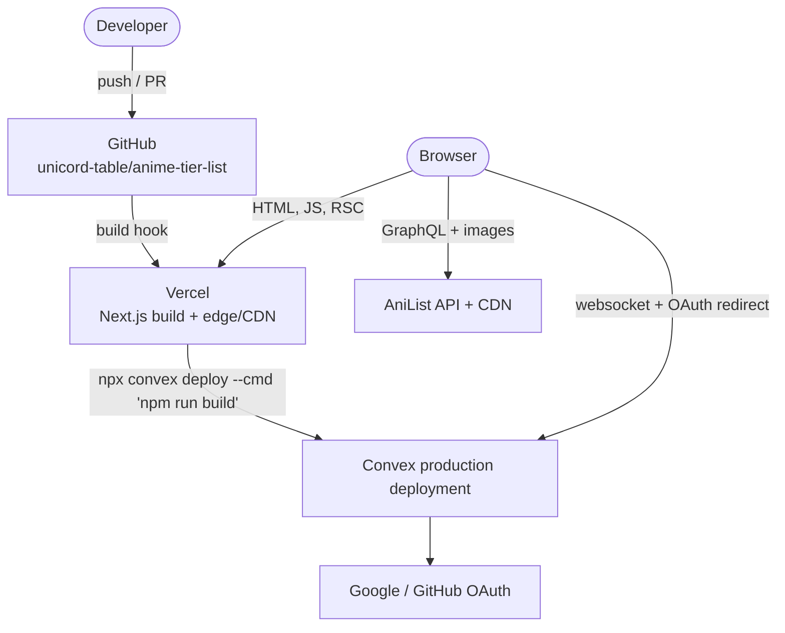

# Deployment

## Today

**Partly verified.** `vercel.json` now exists and pins the build command, so
that row is fact rather than inference. Vercel hosting is still inferred from
`@vercel/analytics` and from the `vercel/install-vercel-web-analytics` branch;
the Convex production deployment is still inferred from `CONVEX_DEPLOYMENT` in
`.env.local`. Confirm those in the dashboards and correct this page when you do.

## Build

| Setting | Value |
| --- | --- |
| Build command | `npx convex deploy --cmd 'npm run build'` — **in `vercel.json`**, not a dashboard setting |
| Output | Next.js default (`.next`) |
| Node | Next 16 requires Node 20.9+ |
| Install | `npm ci` from `package-lock.json` |

`npx convex deploy --cmd` does three things in order: push `convex/` to the
deployment this build is for, inject the resulting `NEXT_PUBLIC_CONVEX_URL` into
the build environment, then run the build. A plain `npm run build` produces a
bundle with no Convex URL — which fails open (no account UI, empty feed) rather
than loudly, so the mistake is easy to miss.

**It lives in `vercel.json` on purpose.** As a dashboard setting it is invisible
to the repo, unreviewable in a PR, and silently absent on a new project or a
fork. The failure it prevents is the one that actually happened: types generated
by `npx convex codegen` typecheck against a deployment that has never received
the functions, so `api.tierlists.feed` compiles and then 500s at request time
with *"Could not find public function"*.

> **Prerequisite: `CONVEX_DEPLOY_KEY` must be set in the Vercel project env.**
> Without it `convex deploy` cannot authenticate and the build now **fails**
> rather than shipping a URL-less bundle. Use a **production** deploy key for
> the production environment and a **preview** deploy key for previews — the
> preview key is what gives each PR its own Convex deployment, which is the
> open question below.

The same guarantee locally is `npm run dev`, which runs `next dev` and
`convex dev` together. Neither environment has a "remember to push" step.

## Environments

| Environment | Next.js | Convex | OAuth apps |
| --- | --- | --- | --- |
| Local | `npm run dev` | same command — `convex dev` runs alongside | Dev OAuth apps, `SITE_URL=http://localhost:3000` |
| Preview | Vercel preview deploy | `convex deploy` via `vercel.json`, needs a **preview** deploy key | **Open** — see below |
| Production | Vercel production | `convex deploy` via `vercel.json` | Production OAuth apps, `SITE_URL` = real origin |

> **Open question: preview deployments.** Vercel gives every PR a unique URL.
> Convex Auth pins `SITE_URL` per deployment and GitHub allows one callback URL
> per OAuth app, so sign-in cannot work on a per-PR preview URL without either a
> Convex preview deployment per branch or a wildcard-tolerant setup. Until
> that's decided, **expect sign-in to be broken on previews** and test auth
> locally or in production.
>
> **This got sharper.** Auth now gates something real — publishing
> ([D15](../decisions.md#d15)) — so a preview where sign-in is broken is a
> preview where the feature under review cannot be exercised. A preview deploy
> key gives each PR its own Convex deployment, which is half the answer; the
> other half is a `SITE_URL` per preview and an OAuth app that tolerates it.

## Secrets

Two separate stores, and putting a secret in the wrong one is the most common
setup failure:

| Store | Contains | Set with |
| --- | --- | --- |
| Vercel project env | `NEXT_PUBLIC_*` only | Vercel dashboard |
| Convex deployment env | `AUTH_GOOGLE_*`, `AUTH_GITHUB_*`, `JWT_PRIVATE_KEY`, `JWKS`, `SITE_URL` | `npx convex env set [--prod]` |

Nothing secret is ever a `NEXT_PUBLIC_*` variable — those are inlined into the
client bundle at build time.

One exception to "Vercel project env contains `NEXT_PUBLIC_*` only":
`CONVEX_DEPLOY_KEY`. It is a secret and it lives there because it authenticates
the build itself, before any Convex environment exists to read it from.

`.env.local` is gitignored and holds `CONVEX_DEPLOYMENT`,
`NEXT_PUBLIC_CONVEX_URL`, `NEXT_PUBLIC_CONVEX_SITE_URL`. There is no
`.env.example` in the repo.

> **Gap.** Add a `.env.example` listing the three keys with placeholder values.
> A contributor currently has to read `ConvexClientProvider` to discover what
> `.env.local` should contain.

## What has no server-side cost today

The editor. It is static output plus browser-direct API calls, so a spike in
users costs Vercel bandwidth and nothing else — AniList's per-IP rate limit is
absorbed by the users themselves ([decisions.md D3](../decisions.md#d3)).

That changes with [sharing.md](sharing.md). Published boards are Convex reads and
writes, and a viral link is a real read load against one document. Convex's
function-call and bandwidth pricing become the cost model at that point. Worth
knowing before the first popular board, not after.

## Planned: what deployment gains

| Addition | Impact |
| --- | --- |
| `/t/[slug]` server component | First route with a server render on the request path; first time Vercel function cold starts matter |
| OG image generation | Generate on publish and store in Convex file storage, not per request |
| Convex actions for keyed sources | Server-side API keys; a new class of secret in the Convex env |
| Rate limiting | Needs a store. Convex table + index is the obvious first answer |

## Gaps to close

- **No CI.** `npm run typecheck && npm run lint && npm test` is documented in
  `CONTRIBUTING.md` as a manual pre-PR step. A GitHub Actions workflow running
  the same three commands on every PR is ~20 lines and removes the honour system.
- **No `.env.example`.** See above.
- **No deployment documented as verified.** See the top of this page.
- **No rollback note.** Vercel rolls back instantly; Convex schema changes do
  not. Once `tierlists` exists, a schema change that drops a field is not
  reversible by redeploying the previous build — write the rollback plan into
  the PR that changes a schema.
