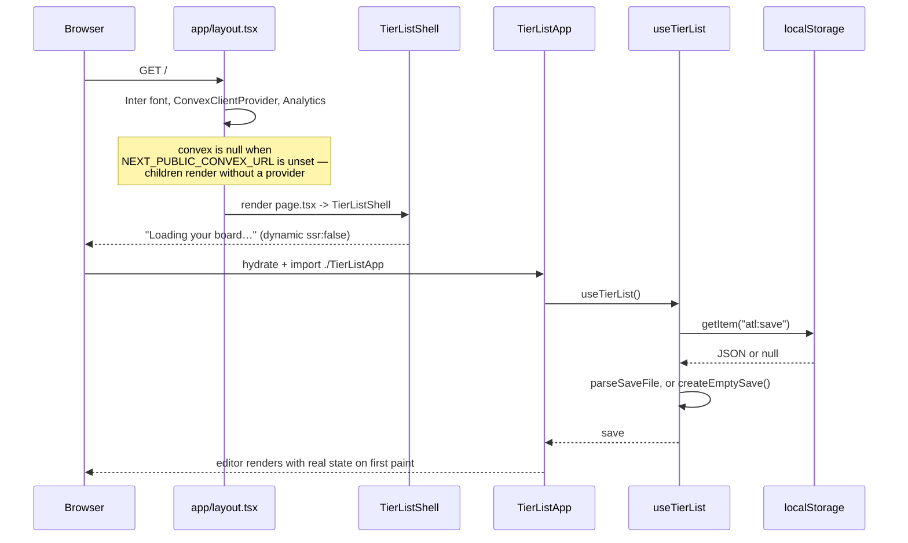
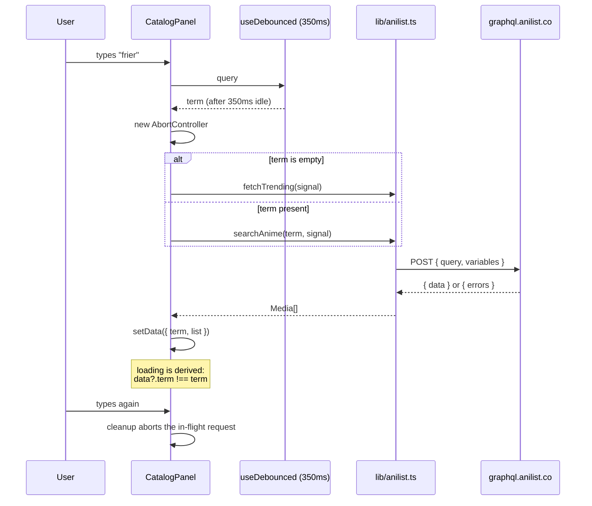
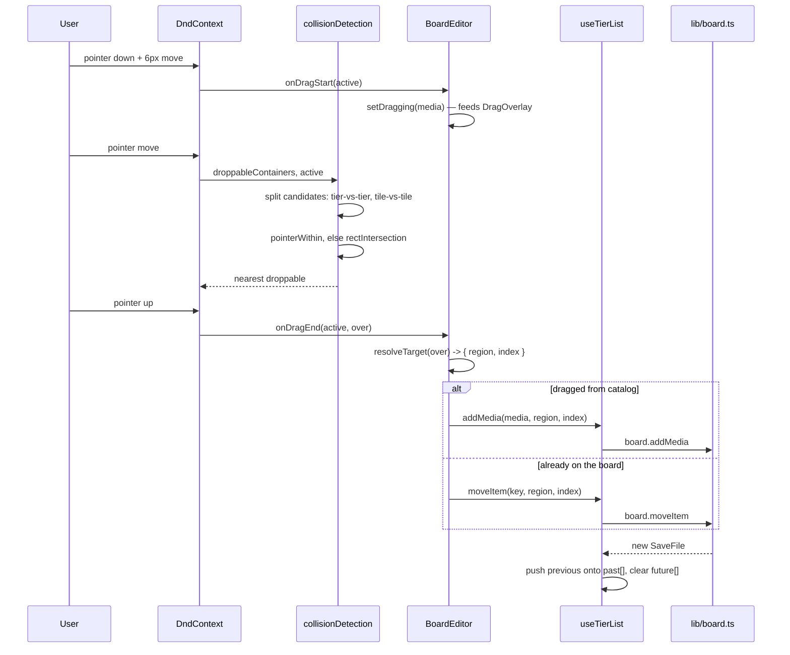
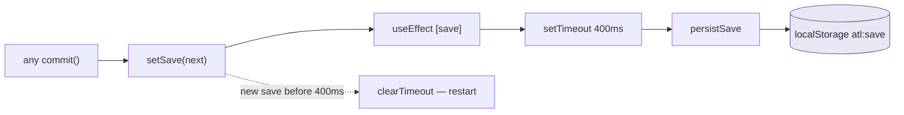
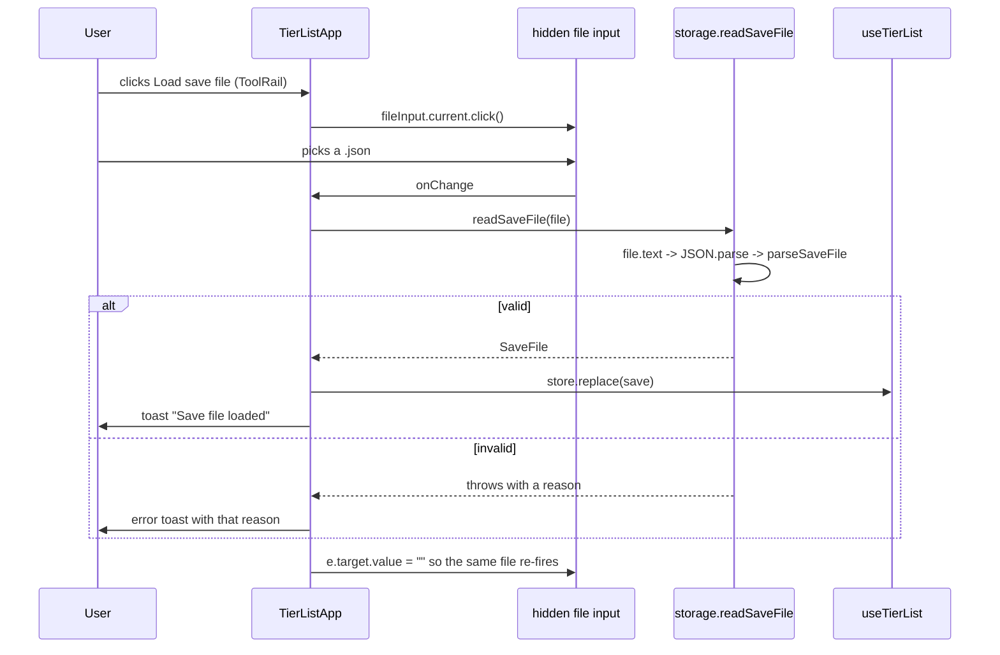
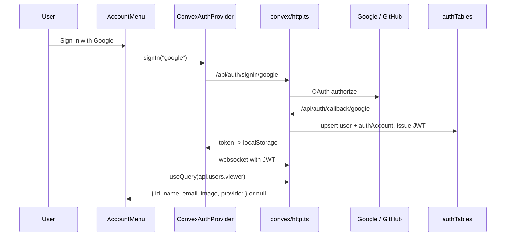
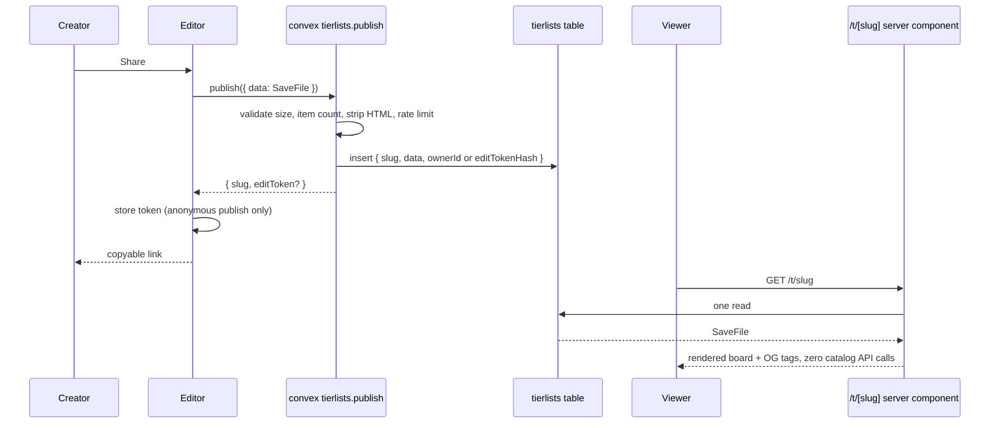

# Lifecycles

What actually happens, step by step, for the flows that matter. All **Built**
unless marked otherwise.

## First paint

The `useState` initialiser reads `localStorage` synchronously. That is only safe
because `ssr: false` guarantees the hook never runs on the server — there is no
server markup for the client to contradict, so no `hydrated` flag and no
set-state-in-effect cascade. See [decisions.md D8](../decisions.md#d8).

If `parseSaveFile` throws, `loadSave` logs `"Discarding unreadable save file"`
and returns `null`, and the user gets a fresh board rather than a white screen.

## Catalog search

Three details that are load-bearing:

- **Results are stored keyed by the term that produced them.** `loading` is
  derived (`data?.term !== term`), not a second state field reset from an
  effect. The same pattern is used in `AnimeDetailModal`, keyed by id.
- **The effect returns `controller.abort()`.** A superseded request is cancelled,
  and the `.catch` early-returns when `controller.signal.aborted`, so a cancelled
  request never clears good results.
- **Errors surface as messages, not statuses.** AniList answers "Private User"
  with an `errors` array on a 404 body, so `gql` checks `json.errors` *before*
  `res.ok`. A 429 is special-cased and reads `Retry-After`.

> The root README mentions an in-memory `Map` cache keyed by query. **No such
> cache exists in `CatalogPanel` or `anilist.ts` today** — only the 350ms
> debounce and request abortion. Treat that line as stale.

## Dragging a card

The collision-detection strategy is the single most surprising piece of code in
the repo and it is there for a reason — full explanation in
[frontend/drag-and-drop.md](../frontend/drag-and-drop.md) and
[decisions.md D5](../decisions.md#d5).

## Autosave

`AUTOSAVE_MS = 400` in `src/lib/useTierList.ts`. `persistSave` swallows quota
and private-mode failures with a `console.warn` rather than throwing — losing an
autosave should not take the editor down with it.

> **Gap.** A failed `persistSave` is invisible to the user; only the console
> knows. If autosave becomes the difference between keeping and losing work,
> route that warning into `useToast`.

## Undo / redo

`commit(fn, { history })` in `useTierList`:

- `history: true` (default) pushes the pre-change `SaveFile` onto `past`,
  capped at `HISTORY_LIMIT = 50`, and clears `future`.
- `history: false` is used by `setTitle` and `renameTier`, because a keystroke
  should not fill the undo stack.
- If `fn` returns the identical object (`next === save`), nothing is committed.
  This is why every no-op path in `board.ts` returns `save` unchanged rather
  than a fresh copy — `moveItem` with an unknown key, `removeTier` with an
  unknown id, `reorderTiers` with `from === to`, `addManyToPool` with nothing
  new. Preserve that when adding operations.

## Load a save file

`parseSaveFile` drops any key in `tiers`/`pool` that has no matching `media`
record rather than rendering an undefined card. That referential-integrity pass
is the reason validation is hand-written — see
[decisions.md D9](../decisions.md#d9).

## Export PNG

`html-to-image` is imported dynamically inside `exportPng`, so the rasteriser is
not in the initial bundle. `toPng` runs against `boardRef`, which
`BoardEditor` attaches to the **inner** wrapper rather than the scroll
container — otherwise the export would capture only the scrolled-into-view
slice. `pixelRatio: 2`, `backgroundColor: "#161826"` (the `--color-canvas`
token, hardcoded here; keep the two in sync).

## Sign-in

Accounts link on **verified email**, so signing in with GitHub and later Google
on the same address lands on one user. Tokens live in `localStorage`, not
httpOnly cookies — the trade and its trigger for reversal are in
[decisions.md D11](../decisions.md#d11). A signed-in user's first paint has no
account UI, because `viewer` resolves over the websocket.

## Planned: publish and open a share link

Not built. Specified in [sharing.md](sharing.md).

The published page needs **no** external API calls: titles and image URLs are
already denormalised into the save file's `media` map. That property is the
reason the data model is shaped the way it is — don't break it.
