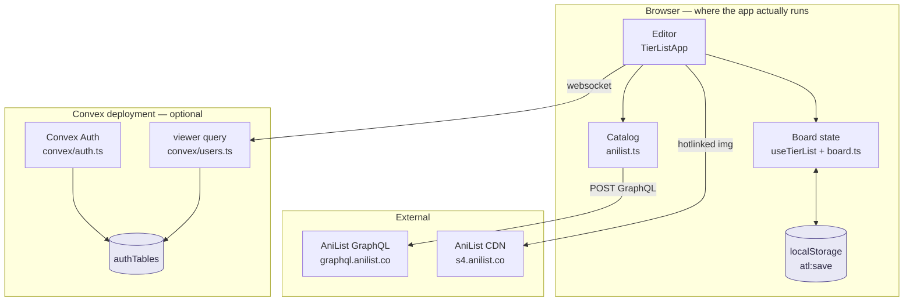

# Architecture overview

> **Status legend used across these docs**
> **Built** — verified against code on 2026-08-08.
> **Planned** — designed here, no code yet. Do not cite as fact.
> **Open** — no decision made. Needs an entry in [decisions.md](../decisions.md).

## What this is

A Next.js 16 App Router application whose editor runs **entirely in the
browser**, with a Convex deployment attached for authentication only. There is
currently no server that stores a tier list — the board lives in `localStorage`.

The product direction (see [product/vision.md](../product/vision.md)) is a
social platform for tier lists on any topic, with link-based sharing, profiles,
and a newsfeed. That work has not started. This document describes what exists
and marks the seams where the planned work attaches.

## Stack — Built

| Layer | Choice | Where |
| --- | --- | --- |
| Framework | Next.js `16.2.12`, App Router | `src/app/` |
| UI | React `19.2.4`, TypeScript strict | `src/components/` |
| Styling | Tailwind v4 via `@tailwindcss/postcss`, tokens as CSS custom properties | `src/app/globals.css` |
| Icons | `@phosphor-icons/react`, tree-shaken by `optimizePackageImports` | `next.config.ts` |
| Drag & drop | `@dnd-kit/core` + `/sortable` + `/modifiers` | `src/components/dnd/`, `src/components/board/BoardEditor.tsx` |
| Backend | Convex `^1.43.0` | `convex/` |
| Auth | `@convex-dev/auth` `^0.0.94` + `@auth/core` (Google, GitHub) | `convex/auth.ts` |
| Raster export | `html-to-image` (dynamic import) | `src/components/TierListApp.tsx` |
| IDs | `nanoid` | `src/lib/useTierList.ts` |
| Analytics | `@vercel/analytics` | `src/app/layout.tsx` |
| Tests | Node's built-in `node --test`, no framework | `src/lib/board.test.ts` |

There is no state-management library, no data-fetching library, no form library,
and no validation library. Board state is one hook; validation is hand-written
(see [decisions.md D9](../decisions.md#d9)).

## Shape

Two things about this diagram are the whole architecture:

1. **The board never crosses the network.** No request the app makes carries a
   tier list. Losing the Convex deployment loses sign-in and nothing else.
2. **The catalog talks to AniList directly, not through a server.** This is a
   deliberate call about rate limits, not an oversight — see
   [decisions.md D3](../decisions.md#d3).

## The one route

`src/app/page.tsx` renders `TierListShell`, which mounts `TierListApp` through
`next/dynamic` with `ssr: false`. There are no other routes, no route handlers,
and no middleware. Reasoning is in [decisions.md D8](../decisions.md#d8).

That single route serves two views, toggled by React state (`BoardView` in
`src/components/board/AppHeader.tsx`), not by navigation:

- `editor` — the working board
- `preview` — `PublicPreview`, a local rehearsal of what a published page will
  look like. It renders from the same in-memory `SaveFile`; nothing is published.

## Where the planned work attaches

| Planned capability | Attachment point in today's code |
| --- | --- |
| Share links | `TierListApp.onShare` currently shows a toast. Needs a Convex mutation + a `/t/[slug]` route. See [sharing.md](sharing.md). |
| Non-anime topics | `src/lib/anilist.ts` is imported directly by `CatalogPanel`. Needs a source registry behind an interface. See [catalog-sources.md](catalog-sources.md). |
| Newsfeed, profiles, follows | Nothing exists. Convex schema is auth-only today. See [social-feed.md](social-feed.md). |
| Server-side rendering of a board | Blocked by the `/react` auth client choice. See [decisions.md D11](../decisions.md#d11). |

## Commands

| Command | What it does |
| --- | --- |
| `npm run dev` | Next dev server on `http://localhost:3000` |
| `npm run build` | Production build |
| `npm test` | `node --test "src/**/*.test.ts"` — board logic only |
| `npm run typecheck` | `tsc --noEmit` |
| `npm run lint` | ESLint (`eslint-config-next` core-web-vitals + typescript) |
| `npx convex dev` | Convex backend watching `convex/`; only needed for sign-in |

`tsconfig.json` excludes `**/*.test.ts` from the build and maps `@/*` →
`./src/*` and `@convex/*` → `./convex/*`.

## Read next

- [context.md](context.md) — system context and containers
- [components.md](components.md) — module map and dependency rules
- [lifecycles.md](lifecycles.md) — what happens on a search, a drag, a load
- [data-model.md](data-model.md) — `SaveFile`, and the Convex schema it becomes
