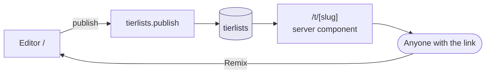

# Share links

**Status: Planned.** Today `TierListApp`'s `onShare` shows the toast
*"Publishing arrives in Phase 2 — export a PNG or .json for now"*. Nothing is
published.

This is the headline feature of the product: hand someone a URL and they see
your tier list. Everything else in the social layer depends on it existing.

## Shape of the feature



**Remix is not optional.** A read-only page is a dead end; "open this in the
editor as my own copy" is what turns one shared link into two boards. It costs
almost nothing — the published document *is* a `SaveFile`, so remix is
`store.replace(data)` plus a fresh local save. Build it in the same phase.

## URLs

| Route | Rendering | Purpose |
| --- | --- | --- |
| `/t/[slug]` | Server component | The shared board. One DB read, zero catalog API calls. |
| `/t/[slug]/opengraph-image` | Route segment | OG card. See [OpenGraph](#opengraph) below. |
| `/` | Client, `ssr: false` | Editor, unchanged |

`slug` is `nanoid(10)` — URL-safe, ~10^17 space, unguessable enough that an
unlisted board is genuinely unlisted. Do not use a title slug: titles collide,
change, and leak content into the URL.

> This is the first server-rendered route in the app, and it is the exact trigger
> condition recorded in [decisions.md D11](../decisions.md#d11) for moving from
> `@convex-dev/auth/react` to `@convex-dev/auth/nextjs`. Decide that **before**
> building `/t/[slug]`, not after — retrofitting means touching every auth
> consumer.

Strictly, `/t/[slug]` only needs auth on the server once the page shows
viewer-specific state (your like, your follow button, "edit this" for the
owner). A first version that renders the board and hydrates interactivity
client-side avoids the migration. Pick deliberately; don't drift into it.

## Ownership: two models, both required

| Publisher | Stored | Can edit by |
| --- | --- | --- |
| Signed out | `editTokenHash`, `ownerId: null` | Presenting the raw token from `localStorage["atl:tokens"]` |
| Signed in | `ownerId`, `editTokenHash: null` | Being that user |

Anonymous publishing has to keep working. It is how a first-time visitor shares
anything, and requiring sign-in to share would gate the product's core loop
behind an account — the opposite of [decisions.md D2](../decisions.md#d2)'s
"optional in the strong sense".

**Token handling.** Generate server-side on publish (`nanoid(32)`), return once,
store only `sha256(token)`. Losing the token means losing edit rights to that
link — acceptable, because the user still holds their local copy and can
republish. A signed-in user should be able to **claim** an anonymous list by
presenting the token, which sets `ownerId` and clears `editTokenHash`.

## Visibility

`public | unlisted | private`, on the document.

| Value | Reachable by link | In feed / browse | `noindex` |
| --- | --- | --- | --- |
| `public` | yes | yes | no |
| `unlisted` | yes | no | yes |
| `private` | owner only | no | yes |

Default new publishes to **`unlisted`**. Someone clicking "Share" is asking for
a link, not for an audience; opting into the feed should be a second, deliberate
action. It also means the first published boards can't fill an empty feed with
test data.

`private` requires `ownerId`, so it is unavailable to anonymous publishers.

## Abuse controls — non-negotiable for this phase

This is the phase where an anonymous user can write to your database. Every
control below ships with it, not after it.

| Control | Value | Why |
| --- | --- | --- |
| Payload cap | ~256 KB serialized | Nothing legitimate is bigger. Convex documents cap at 1 MB regardless |
| Item cap | ~500 items | Bounds render cost of the public page |
| Tier cap | ~26 tiers | Same |
| Publishes per IP | Rate-limited | Cheapest defence against a flood |
| Text sanitisation | Strip HTML from `title` and tier `label`; render as text | The only free text the user controls |
| Image URL allowlist | Only `imageHosts` from registered sources | Stops the board being used as a tracker or an image host |
| `noindex` on `/t/[slug]` | Until discovery is wanted | Keeps junk out of search results |
| Report button + `reports` table | From day one | You need somewhere for a takedown request to land before you need it |

The image allowlist is new relative to the original plan and it matters more
than it looks: without it, a published board is an arbitrary-URL renderer that
anyone can point at anything, which is both a tracking vector and someone else's
bandwidth bill.

**On the 1,200-title import.** The app already supports importing a whole
AniList profile. That will exceed the 500-item publish cap. Cap the publish, not
the import, and say so in the error: *"Published boards are capped at 500 items —
this board has 1,240."*

## Mutations

```ts
// convex/tierlists.ts (Planned)

publish({ data, visibility })
  -> validate(data) -> { slug, editToken? }

update({ slug, data, editToken? })
  -> requires ownerId match OR sha256(editToken) === editTokenHash

claim({ slug, editToken })
  -> requires signed in; sets ownerId, clears editTokenHash

get({ slug })
  -> respects visibility; increments viewCount (see below)
```

`validate(data)` is one shared function used by both `publish` and `update`, and
it is the same referential-integrity pass as `parseSaveFile` plus the caps
above. **Share the code with the client** — `src/lib/` is importable from
`convex/` in this repo layout, and a validation rule that exists in only one of
the two places will drift.

**View counts.** Incrementing a counter on every read makes every page view a
write, and turns one hot board into a write-contention hotspot. Options, cheapest
first: don't count views at all; count them in a periodic aggregate; or
increment a sharded counter. Do not put a naive `viewCount++` in the `get`
query — queries in Convex can't write anyway, so it would have to become a
mutation on every page load. **Open** — needs a decision before launch.

## OpenGraph

A shared link that unfurls as a blank card gets clicked much less. The board
needs an image.

Three options, in order of cost:

1. **Static card** — title, item count, topic, rendered as an OG image route
   from text only. Cheap, boring, works everywhere.
2. **Composite of the top tier's covers** — fetch the first ~5 `items` images
   and lay them out. Needs the images to be fetchable server-side (they are;
   they're public CDN URLs) and respects the same allowlist.
3. **Full board render** — a real screenshot. Expensive, needs a headless
   browser, out of scope.

Start at (2), fall back to (1) when a board has no images (a `custom`-source
board often won't). Generate on publish and store in Convex file storage rather
than rendering per request — the board only changes when it is updated.

## What the published page must not do

- **No catalog API calls.** Titles and image URLs are denormalized into the
  `SaveFile`'s `items` map precisely so the public page is one DB read. If you
  ever find yourself calling AniList from `/t/[slug]`, the data model has been
  broken.
- **No editor bundle.** The public page should not ship `@dnd-kit` or
  `html-to-image`. Keep the read-only board renderer a separate component from
  `BoardEditor`. `PublicPreview` is the natural starting point — it already
  renders a board read-only from a `SaveFile`.

## Done when

A link opens correctly in a private window, on someone else's machine, with the
publisher signed out — and unfurls with an image in a chat app.
