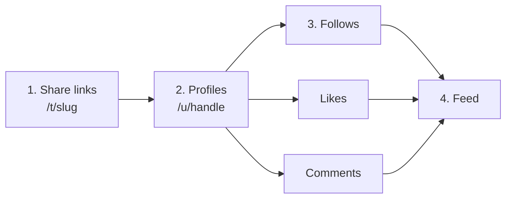
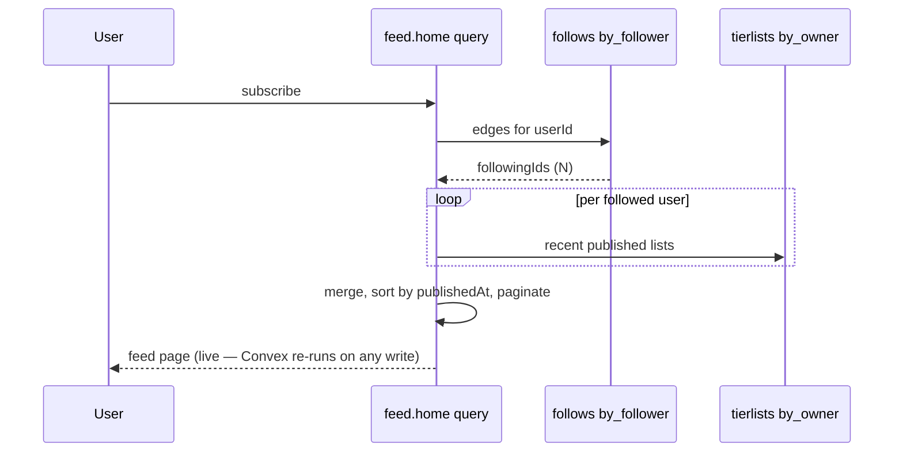

# Social graph and newsfeed

**Status: Planned.** No code, no schema. This is the largest unbuilt area and
the one most likely to be over-built, so it is written with explicit "don't do
this yet" lines.

> **Supersedes a previous decision.** The old roadmap listed *"Comments / likes /
> feeds — Never, probably; that's a different product."* That is reversed: it is
> now the product. Recorded as [D12](../decisions.md#d12).

## Order of operations

Do not build this before sharing works. A feed with nothing to link to is an
empty page, and every entity below points at a published tier list.



Profiles come second because a like or a follow with nothing to attach to is
meaningless, and because "here are all my tier lists" is a useful page on its
own the moment one person publishes twice.

## Profiles

`profiles` is separate from the auth `users` table rather than fields added to
it. Two reasons: `authTables.users` is owned by `@convex-dev/auth` and adding to
it couples you to that library's shape; and a profile is public while a user
record holds an email.

| Field | Notes |
| --- | --- |
| `userId` | FK to `users` |
| `handle` | Unique, lowercase, `[a-z0-9_]{3,20}`. Chosen at first publish, not at sign-up |
| `displayName` | Defaults from the OAuth profile name |
| `bio` | Short, plain text, sanitised |
| `followerCount`, `followingCount` | Denormalized, maintained transactionally |

**Handle at first publish, not at sign-up.** Sign-in is optional and currently
gates nothing ([D2](../decisions.md#d2)); forcing a username picker into the
sign-in flow adds friction to something that today grants only a name and an
avatar. Ask when the user first needs a public identity.

Reserve a blocklist of handles (`admin`, `api`, `t`, `u`, `feed`, `about`,
`settings`, …) before the first one is claimed. Route collisions are annoying to
undo.

## Follows

One document per edge: `{ followerId, followingId, createdAt }`. Indexed
`by_follower` and `by_following`. Unique on the pair — check before insert in the
mutation; Convex has no unique constraint.

Follows are **asymmetric** (Twitter-style), not friend requests. A tier list is
published content, not a private conversation, so the mutual-consent model buys
nothing and doubles the state machine.

## Likes

`{ userId, tierlistId, createdAt }`, indexed `by_user_tierlist` (both "did I
like this" and the uniqueness check) and `by_tierlist`.

The mutation must insert the row **and** increment `tierlists.likeCount` in the
same transaction. Convex mutations are transactional, so the two cannot diverge —
that is the whole reason the counter is safe to denormalize.

Likes require sign-in. This is the first thing in the product that does, which
makes it the moment sign-in stops being free-floating and starts being load-
bearing. It is also the honest trigger for re-examining
[D11](../decisions.md#d11)'s localStorage tokens — a session that can mutate
shared state is worth more to steal than one that shows a name and an avatar.

## Comments

`{ tierlistId, authorId, parentId, body, createdAt, deleted }`.

One level of nesting. `parentId` is either `null` or a top-level comment's id —
never a reply's. Arbitrary-depth threading is a rendering and moderation problem
with no payoff at this size, and the field shape above allows deepening later
without a migration.

Soft-delete (`deleted: true`, body blanked) rather than removing the row, so
replies don't orphan.

Comments need, from day one: sanitisation, a length cap, a per-user rate limit,
and a report action. A comment box on a public page is the single highest-risk
surface in the product.

## The feed

### Read-time assembly (start here)



Assemble the feed by querying the follow edges and then recent lists per
followed user. This is fan-out-on-read, and it is right to start with because:

- It has no write amplification. Publishing costs one insert.
- It cannot get out of sync — there is no derived copy to rebuild.
- Convex queries are **reactive**. The feed updates live with no polling and no
  invalidation logic, which is the single biggest reason Convex is a good fit for
  this workload.

It costs a query per followed account. That is fine at tens of follows and stops
being fine somewhere in the hundreds.

**Switch to fan-out-on-write when** a feed page issues more than ~50 sub-queries,
*or* p95 feed latency exceeds ~300 ms. Then `feedEvents` becomes per-recipient
rows written at publish time, and you inherit the backfill problem for a new
follow. Don't pre-build it — record the trigger and move on.

### Ranking

Reverse-chronological. Not an algorithm.

A chronological feed is debuggable, explainable, and correct at low volume, and
an engagement-ranked feed on a product with no volume mostly ranks noise. The
place to spend novelty budget is **discovery** — a topic browse page and a
"trending this week" query over `likeCount` and `publishedAt` — which serves the
same need (something to look at when you follow nobody) without the machinery.

That also fixes the cold-start problem: a new user's home feed is empty, so the
default tab should be discovery, not home.

### `feedEvents`

Written on publish / like / comment / follow. In the read-time model it is **not**
what renders the feed — it is the substrate for notifications and the migration
path to fan-out-on-write. If you are not building notifications yet, you can
defer the table entirely; note the omission rather than writing rows nobody
reads.

## Authorization

Today `convex/users.ts` says it plainly: `viewer` returns `null` because
signed-out is a valid answer, and **anything that writes must throw on a null
user id**. With one query that is a comment. With a dozen mutations it needs to
be a shared helper:

```ts
// convex/lib/auth.ts (Planned)
export async function requireUser(ctx: MutationCtx) {
  const userId = await getAuthUserId(ctx);
  if (userId === null) throw new ConvexError("Not signed in");
  return userId;
}

export async function requireOwner(ctx: MutationCtx, tierlistId: Id<"tierlists">) {
  const userId = await requireUser(ctx);
  const list = await ctx.db.get(tierlistId);
  if (!list || list.ownerId !== userId) throw new ConvexError("Not yours");
  return { userId, list };
}
```

Every mutation starts with one of these. A per-function reimplementation is how
an authorization hole gets in.

Anonymous publish is the deliberate exception, and it authorizes on the edit
token instead — see [sharing.md](sharing.md#ownership-two-models-both-required).

## Moderation

A public feed with anonymous publishing needs a floor, and it is cheaper to
build the floor than to retrofit it:

- A `reports` table and a report action on every board and comment.
- Soft-delete / hide on `tierlists` and `comments` that a moderator can set.
- `noindex` by default until you actively want search traffic.
- No image uploads, ever — the reason is in [D6](../decisions.md#d6), and it is
  precisely to avoid an image-moderation obligation. The
  [image URL allowlist](sharing.md#abuse-controls--non-negotiable-for-this-phase)
  is what keeps that true once boards are public.

There is no moderation UI in scope. A report that lands in a table you can query
is enough to start; a queue can wait until there is a second report.

## Deliberately out of scope

| Not building | Reconsider when |
| --- | --- |
| Algorithmic ranking | Chronological visibly fails — hundreds of follows, or a real volume problem |
| Fan-out-on-write feeds | The trigger above is hit |
| Direct messages | Never for this product. Different risk surface entirely |
| Realtime collaborative editing | Two people actually ask. Convex would make it tractable, which is not a reason to build it |
| Quote-posts / reshares | After likes and comments have real usage — it's a third engagement type competing with two unproven ones |
| Notifications | After `feedEvents` exists for another reason |
