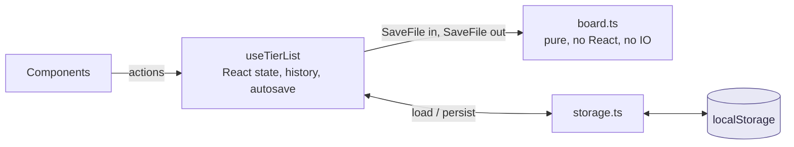

# Board state

**Status: Built.** `src/lib/useTierList.ts` + `src/lib/board.ts`.

One hook owns the board. There is no state library, no context, and no store —
`TierListApp` calls `useTierList()` once and passes the returned `TierListStore`
down as a prop.

## The split



Everything that decides *what a board looks like* is in `board.ts` and is a pure
function. Everything that decides *when* is in the hook. That line is why
`board.test.ts` can run under `node --test` with no framework and no build step.

## `board.ts` contract

Every mutating function has the signature `(save: SaveFile, ...args) => SaveFile`
and follows three rules:

1. **Never mutate.** Return a new object. Callers rely on identity change.
2. **Return `save` itself on a no-op.** `moveItem` with an unknown key,
   `removeTier` with an unknown id, `reorderTiers` where `from === to`,
   `addManyToPool` with nothing new — all return the input unchanged.
3. **Call `touch()` on a real change.** It refreshes `updatedAt`. Skipping it
   means a change that doesn't register as newer, which matters for any future
   sync.

Rule 2 is load-bearing: `commit` short-circuits on `next === save`, so a no-op
never pushes an undo entry and never triggers an autosave. Returning a fresh
copy instead would fill the undo stack with nothing.

### The operations

| Function | Notes |
| --- | --- |
| `createEmptySave()` | Six tiers, fixed ids `t1`–`t6`, first six preset colours |
| `placedKeys(save)` | `Set` of every key in tiers + pool. Drives the catalog's "already added" state |
| `itemsOf(save, region)` | Region → ordered keys |
| `moveItem(save, key, region, index)` | Detach from everywhere, then insert |
| `addMedia(save, media, region, index)` | Registers the record, then `moveItem` |
| `addManyToPool(save, list)` | Skips anything already placed; appends |
| `removeItem(save, key)` | Detaches **and** deletes the `media` record |
| `addTier(save, id)` | Colour cycles `tiers.length % TIER_PRESET_COLORS.length` |
| `removeTier(save, id)` | Returns the tier's items to the pool, never discards them |
| `reorderTiers(save, id, beforeId)` | Splice out, splice in at the target's index |
| `renameTier` / `recolorTier` / `setTitle` | Thin wrappers over `patchTier` / `touch` |
| `rankedCount(save)` | Items in tiers, excluding the pool |

### Why `moveItem` detaches first

```ts
const base = detach(save, key);          // remove from every region
// then insert at `index`
```

`index` follows dnd-kit's `arrayMove` semantics: it is the slot in the list
*after* the item has been pulled out. So detach-then-insert is already correct
in both directions, and "compensating" for the shift double-counts it. This is
commented in the source because it is the kind of thing that looks like a bug
and gets ✨fixed✨ into an actual bug.

### `removeItem` and referential integrity

`removeItem` deletes the `media` record along with the keys. It must, or the
`media` map grows forever with orphans that `parseSaveFile` would then keep
loading. Conversely, anything that drops a key must not leave a dangling
reference — `parseSaveFile` filters unresolvable keys as a backstop, but relying
on the backstop means silently losing cards.

## `useTierList`

```ts
const store = useTierList();
// store.save, store.placed, store.rankedCount
// store.canUndo, store.canRedo, store.undo, store.redo
// + every action
```

### State

| Piece | Purpose |
| --- | --- |
| `save` | Current `SaveFile`. Initialised from `loadSave() ?? createEmptySave()` |
| `past` | Snapshots, capped at `HISTORY_LIMIT = 50` |
| `future` | Redo stack, cleared on any new commit |

The `useState` initialiser reads `localStorage` **synchronously**. Safe only
because `TierListApp` is mounted `ssr: false` — see
[decisions.md D8](../decisions.md#d8). If that ever changes, this line is the
first thing that breaks.

### `commit`

```ts
commit(fn, { history = true })
```

- Computes `next = fn(save)`; bails if `next === save`.
- With history: pushes `save` onto `past` (sliced to the cap), clears `future`.
- Without history: replaces `save` only.

`setTitle` and `renameTier` pass `history: false`, because a keystroke should not
be an undo step. The stated upgrade, if anyone asks, is coalescing per field
rather than recording every character.

### Autosave

`useEffect` on `[save]`, `setTimeout(persistSave, 400)`, cleared on change.
`persistSave` swallows quota / private-mode errors with a `console.warn`.

> **Gap.** A failed autosave is invisible to the user. If the board becomes
> someone's only copy of real work, surface that warning through `useToast`.

## Adding an operation

1. Write the pure function in `board.ts`. Return `save` unchanged on a no-op;
   `touch()` otherwise.
2. Add a case to `board.test.ts`.
3. Expose it in the `actions` memo in `useTierList`, choosing `history` honestly
   — structural change yes, text edit no.
4. Call it from a component. Do not add board logic to the component.

`npm test` must stay runnable with no build step, so **do not add a runtime
import to `board.ts`**. Types only.

## Known limits

| Limit | Consequence |
| --- | --- |
| History is full snapshots | 50 copies of a 1,200-item board is real memory. Fine today; measure if imports get bigger |
| Fixed tier ids `t1`–`t6` | Collide across boards. Must become `nanoid(6)` before tier ids are stored server-side — see [data-model.md](../architecture/data-model.md#defaults) |
| One board at a time | `atl:save` is a single key. Multiple local boards need a key-per-board scheme, and that lands with sharing |
| No conflict handling | There is nothing to conflict with yet. Publishing introduces it |
